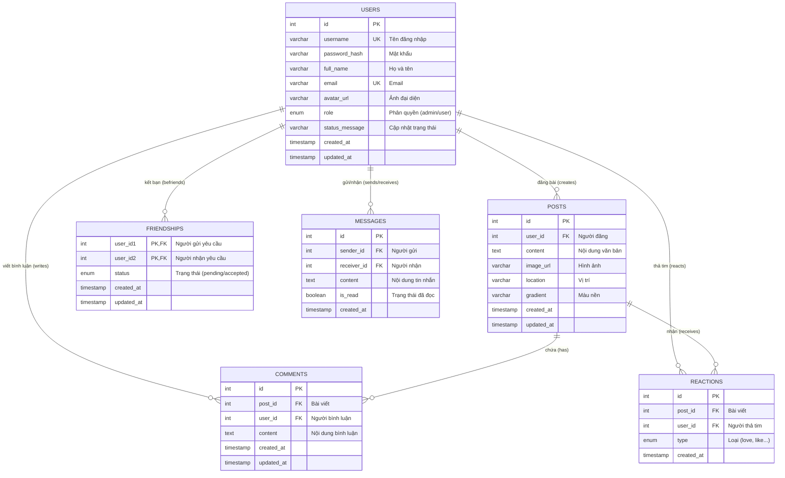

# Sơ đồ thực thể liên kết (ERD) - Mini Social Network

Dưới đây là sơ đồ ERD chi tiết mô tả các bảng, thuộc tính (cột) và mối quan hệ (foreign keys) trong cơ sở dữ liệu:

### Chú thích ký hiệu:
* **PK (Primary Key):** Khóa chính, định danh duy nhất cho mỗi dòng dữ liệu.
* **FK (Foreign Key):** Khóa ngoại, liên kết sang cột `id` của bảng khác.
* **UK (Unique Key):** Ràng buộc dữ liệu duy nhất không được trùng lặp.
* **`||--o{`**: Ký hiệu quan hệ 1-N (Một - Nhiều). Ví dụ: 1 Người dùng có thể Đăng Nhiều Bài viết.
